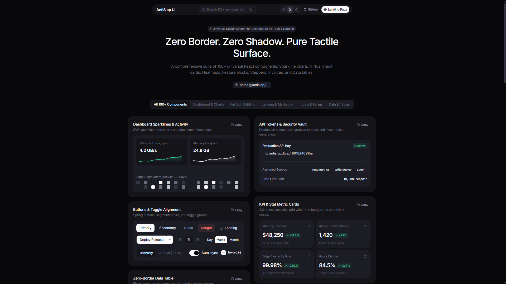
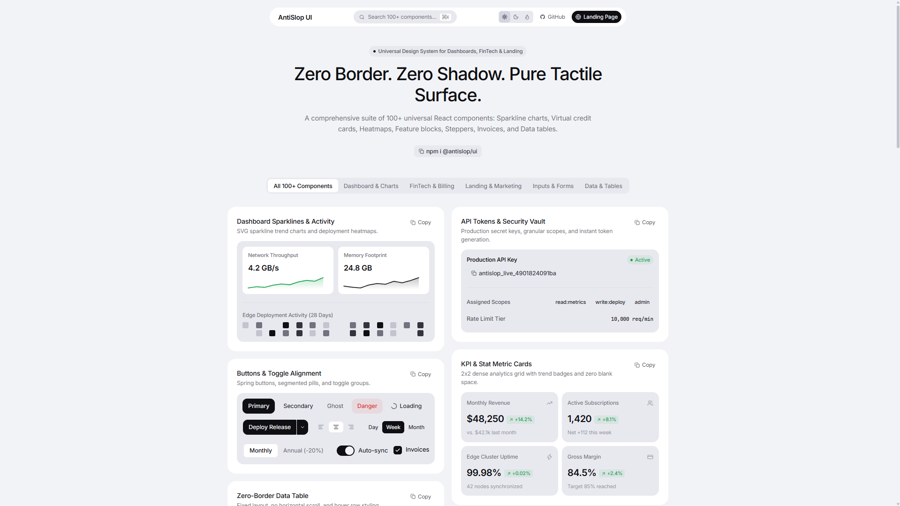

<div align="center">

# AntiSlop UI

**Zero-Border, Zero-Shadow Design System and Component Library for React.**

[](https://www.npmjs.com/package/@danilvladov/antislop-ui)
[](LICENSE)
[](https://www.typescriptlang.org/)
[](https://react.dev/)
[](https://bundlephobia.com)

<p align="center">
  <a href="#overview">Overview</a> &bull;
  <a href="#design-invariants">Design Invariants</a> &bull;
  <a href="#visual-preview">Visual Preview</a> &bull;
  <a href="#installation">Installation</a> &bull;
  <a href="#quick-start">Quick Start</a> &bull;
  <a href="#design-tokens">Design Tokens</a> &bull;
  <a href="#component-api">Component API</a> &bull;
  <a href="#license">License</a>
</p>

</div>

---

## Visual Preview

### Dark Theme Interface


### Light Theme Interface


---

## Overview

AntiSlop UI is a React component system built around strict visual invariants: **zero borders** and **zero drop shadows**. 

Traditional web interfaces rely heavily on 1px borders and artificial blurred box-shadows to separate elements. In dense dashboard and FinTech environments, this creates visual noise, unnecessary cognitive load, and dated aesthetics.

AntiSlop UI establishes depth, elevation, and hierarchy exclusively through:
1. **Calibrated Multi-Layer Surface Luminance**: Discrete luminance contrast steps between Canvas, Surface, Soft container, and Sunken inputs.
2. **macOS-Grade Spring Physics**: Tactile cubic-bezier transitions (`cubic-bezier(0.175, 0.885, 0.32, 1.275)`) delivering immediate physical feedback.
3. **Hardware-Accelerated Backdrop Filters**: Optical blur overlays (`backdrop-filter: blur(16px–20px)`) for sheets, dialogs, and floating navigation.
4. **Zero External Runtime Dependencies**: Pure React and standard CSS Custom Properties.

---

## Design Invariants

```
+-------------------------------------------------------------------+
| Layer 0: App Canvas Canvas             (--p-app: #08080a)         |
|   +-------------------------------------------------------------+ |
|   | Layer 1: Elevated Surface Card     (--p-surface: #141419)   | |
|   |   +-------------------------------------------------------+ | |
|   |   | Layer 2: Inner Widget Container (--p-soft: #1c1c24)   | | |
|   |   |   +-------------------------------------------------+ | | |
|   |   |   | Layer 3: Tactile Recessed Input (--p-input-bg)  | | | |
|   |   |   +-------------------------------------------------+ | | |
|   |   +-------------------------------------------------------+ | |
|   +-------------------------------------------------------------+ |
+-------------------------------------------------------------------+
```

| Property | AntiSlop UI Standard | Conventional UI Libraries |
| :--- | :--- | :--- |
| **Borders** | `border: none` (0px) | `1px solid rgba(255,255,255,0.1)` |
| **Shadows** | `box-shadow: none` | `0 10px 30px rgba(0,0,0,0.5)` |
| **Depth Engine** | Multi-tier surface luminance | Blur radii and spread distances |
| **Overlays** | Hardware optical blur (`16px`) | Solid tint with high opacity |
| **Interaction Physics** | Sub-millisecond spring curves | Linear or generic ease-in-out |
| **Bundle Overhead** | Zero runtime CSS dependencies | Heavy runtime CSS-in-JS injection |

---

## Installation

Install `@danilvladov/antislop-ui` along with `lucide-react` icons:

```bash
npm install @danilvladov/antislop-ui lucide-react
```

Or using alternative package managers:

```bash
# pnpm
pnpm add @danilvladov/antislop-ui lucide-react

# bun
bun add @danilvladov/antislop-ui lucide-react

# yarn
yarn add @danilvladov/antislop-ui lucide-react
```

Import design tokens in your application entry point (`main.tsx`, `index.tsx`, or `_app.tsx`):

```tsx
import '@danilvladov/antislop-ui/styles/tokens.css';
```

---

## Quick Start

### FinTech Analytics & Controls Example

```tsx
import React, { useState } from 'react';
import {
  Card,
  StatCard,
  Sparkline,
  Input,
  PasswordInput,
  PinInput,
  Select,
  Button,
  Dialog,
  Badge,
} from '@danilvladov/antislop-ui';
import { Mail, Zap, TrendingUp } from 'lucide-react';

export function ClusterDashboard() {
  const [pin, setPin] = useState('5921');
  const [plan, setPlan] = useState('pro');
  const [dialogOpen, setDialogOpen] = useState(false);

  return (
    <Card
      title="Cluster Infrastructure"
      subtitle="42 edge nodes synchronized with zero cold starts."
      action={<Badge variant="success" dot>Operational</Badge>}
    >
      {/* 2x2 Metric Grid */}
      <div style={{ display: 'grid', gridTemplateColumns: '1fr 1fr', gap: 10 }}>
        <StatCard
          title="Throughput"
          value="4.8 GB/s"
          change="+14.2%"
          trend="up"
          icon={<TrendingUp size={13} />}
        />
        <div style={{ padding: 12, backgroundColor: 'var(--p-soft)', borderRadius: 'var(--p-r-md)' }}>
          <Sparkline
            data={[14, 22, 18, 36, 42, 38, 56, 64, 58, 80]}
            color="var(--p-success)"
            height={32}
          />
        </div>
      </div>

      {/* Tactile Form Inputs */}
      <Input
        label="Workspace Email"
        icon={<Mail size={13} />}
        value="alex.chen@antislop.dev"
        onChange={() => {}}
      />

      <PasswordInput
        label="Access Secret"
        value="secret_live_8912"
        onChange={() => {}}
      />

      {/* Aligned 2FA PIN and Select Controls */}
      <div style={{ display: 'grid', gridTemplateColumns: 'auto 1fr', gap: 16, alignItems: 'flex-start' }}>
        <PinInput
          label="2FA PIN Code"
          length={4}
          value={pin}
          onChange={setPin}
        />
        <div style={{ minWidth: 0 }}>
          <Select
            label="Plan"
            value={plan}
            onChange={setPlan}
            options={[
              { value: 'core', label: 'Community Core ($0)' },
              { value: 'pro', label: 'Enterprise Pro ($49/mo)' },
              { value: 'scale', label: 'Dedicated Scale (Custom)' },
            ]}
          />
        </div>
      </div>

      <Button
        variant="primary"
        icon={<Zap size={13} />}
        onClick={() => setDialogOpen(true)}
      >
        Deploy Infrastructure
      </Button>

      {/* Optical Blur Sheet Dialog */}
      <Dialog
        open={dialogOpen}
        onClose={() => setDialogOpen(false)}
        title="Confirm Infrastructure Deployment"
        description="Propagating 100+ design tokens across 42 global edge clusters."
        icon={<Zap size={18} color="var(--p-success)" />}
        footer={
          <>
            <Button variant="ghost" size="sm" onClick={() => setDialogOpen(false)}>
              Cancel
            </Button>
            <Button
              variant="primary"
              size="sm"
              onClick={() => setDialogOpen(false)}
            >
              Deploy Now
            </Button>
          </>
        }
      >
        <p>Deployment will initiate mTLS mutual handshake across all regional nodes.</p>
      </Dialog>
    </Card>
  );
}
```

---

## Design Tokens

Tokens are exposed as standard CSS Custom Properties and adapt automatically based on the `data-theme` attribute (`light`, `dark`, or `midnight`).

```html
<html data-theme="dark">
```

### Surface & Canvas Tokens

| Token | Light (`light`) | Dark (`dark`) | Midnight (`midnight`) | Description |
| :--- | :--- | :--- | :--- | :--- |
| `--p-app` | `#f2f3f6` | `#08080a` | `#020204` | Application canvas canvas |
| `--p-surface` | `#ffffff` | `#141419` | `#0e0e13` | Elevated card container |
| `--p-soft` | `#e8e9ef` | `#1c1c24` | `#161620` | Inner widget background |
| `--p-input-bg` | `#eaebee` | `#14141a` | `#0b0b10` | Tactile recessed input |
| `--p-hover` | `#dedfe7` | `#252530` | `#20202e` | Interactive hover state |
| `--p-t-900` | `#0f0f13` | `#fafafc` | `#ffffff` | Primary text |
| `--p-t-500` | `#717180` | `#6c6c7c` | `#5a5a68` | Secondary / muted text |
| `--p-success` | `#16a34a` | `#34d399` | `#34d399` | Success / live indicator |
| `--p-danger` | `#dc2626` | `#f87171` | `#f87171` | Error / danger state |

### Motion & Radius Tokens

```css
--p-r-sm: 6px;
--p-r-md: 10px;
--p-r-lg: 14px;
--p-r-xl: 18px;
--p-r-full: 9999px;

--p-ease: cubic-bezier(0.22, 0.61, 0.36, 1);
--p-ease-out: cubic-bezier(0.16, 1, 0.3, 1);
--p-ease-spring: cubic-bezier(0.175, 0.885, 0.32, 1.275);
```

---

## Component API

The library exports 100+ primitives and composite modules organized across functional domains:

### 1. Structure & Shell
- `Card`: Zero-border container with header, subtitle, actions, and surface contrast.
- `SectionHeader`: Section titles with metadata counters and action slots.
- `Divider`: Pure surface separator without 1px border lines.
- `Breadcrumb`: Interactive navigation path with click handlers.
- `Stack`: Flexible flexbox alignment container.

### 2. Form Controls & Inputs
- `Input`: Single-line text field with icon prefixes, suffixes, and error states.
- `PasswordInput`: Masked input with toggle visibility action.
- `PinInput`: 2FA OTP segmented input with automatic key navigation and backspace handling.
- `NumberInput`: Stepper control with increment and decrement constraints.
- `Textarea`: Multi-line text input with automatic line height calculation.
- `SearchInput`: Search control with keyboard shortcut (`⌘K`) indicator and clear action.
- `Dropzone`: Drag-and-drop file upload zone.

### 3. Selection & Ranges
- `Select`: Custom dropdown selector with keyboard navigation.
- `MultiSelect`: Multi-item pill selector with individual tag removal.
- `Slider`: Range slider with tactile thumb physics.
- `RangeSlider`: Dual-handle min/max range selector.
- `DatePicker`: Calendar date picker with month navigation.
- `ColorPicker`: Palette swatch selector.
- `SegmentedControl`: Sliding pill selector with spring transitions.
- `Checkbox`: Tactile toggle box.
- `Switch`: iOS-style binary switch.
- `RadioGroup`: Segmented radio option list.

### 4. FinTech & Telemetry
- `Sparkline`: Lightweight SVG trend sparkline chart with customizable stroke and fill.
- `StatCard`: KPI summary card with percentage delta, direction indicators, and icon slots.
- `ActivityHeatmap`: Contribution and activity matrix grid.
- `PricingTier`: SaaS subscription tier card with feature checklist and popular highlight.
- `CreditCardPreview`: Virtual credit card renderer with chip and masked PAN.
- `InvoiceRow`: Financial transaction row item with status badge.

### 5. Overlays & Dialogs
- `Dialog`: macOS-style sheet dialog with `16px` backdrop blur and escape key handling.
- `Drawer`: Slide-out panel for configurations and complex forms.
- `CommandPalette`: Global `⌘K` command search palette with fuzzy filtering.
- `ContextMenu`: Right-click contextual action menu.
- `DropdownMenu`: Anchor-aligned action menu.
- `Tooltip`: Micro-interaction tooltip with automatic positioning.

### 6. Data & Feedback
- `Table`: Zero-border fixed data table with hover highlighting and row click callbacks.
- `Badge`: Capsule badge with status dot indicators (`success`, `danger`, `neutral`, `pro`).
- `StatusDot`: Animated heartbeat status indicator.
- `Progress`: Linear progress indicator with percentage output.
- `CircularProgress`: Radial progress gauge with SVG stroke calculations.
- `Spinner`: Micro-interaction loading indicator.
- `Skeleton`: Content placeholder shimmer with rectangle, circle, and text variants.
- `Toast`: Imperative notification toast system.
- `Accordion`: Collapsible disclosure panel with spring physics.
- `Tree`: Hierarchical folder and node tree navigator.
- `Timeline`: Chronological event sequence list.

---

## Local Development

```bash
# Clone the repository
git clone https://github.com/starface77/antislop-ui.git

# Navigate to project directory
cd antislop-ui

# Install dependencies
npm install

# Start development server
npm run dev

# Run production build validation
npm run build
```

---

## License

MIT License &copy; 2026 **AntiSlop UI Foundation**

Free for use in personal, open-source, and commercial SaaS applications.
